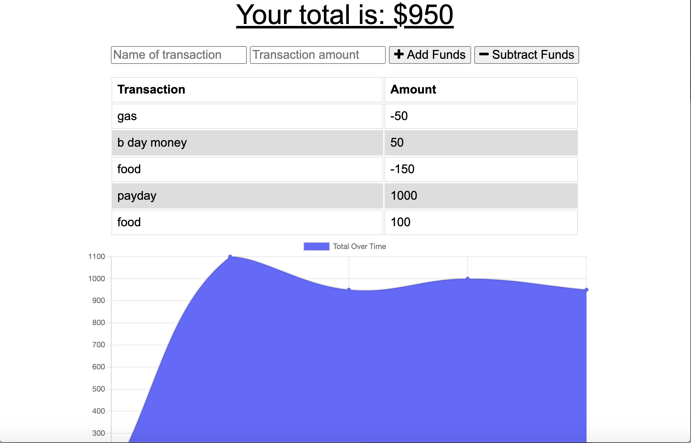

  
  # budget-tracker 
  ## Description 
  I created a budgeting app that allows the user to track transactions. You can deposit or withdraw money, and write the name of the transaction. No internet? No problem this app works offline! Once the connection is restored, the budget tracker will update with everything you have entered offline.   
  ## Table of Contents 
  * [Installation](#installation) 
  * [Usage](#usage) 
  * [Example](#example)
  ## Installation
  You first need to run npm install to install all the dependencies, then start the server by running npm start. Local host is set to 3000.
  ## Usage
  Once the app is running, it will show you the total amount of money you have. You can enter the name of the transaction, transaction amount, and whether you are adding or subtracting funds. There is also a graph to show your total balance for each day over time. 
  ## Example
  
   
  